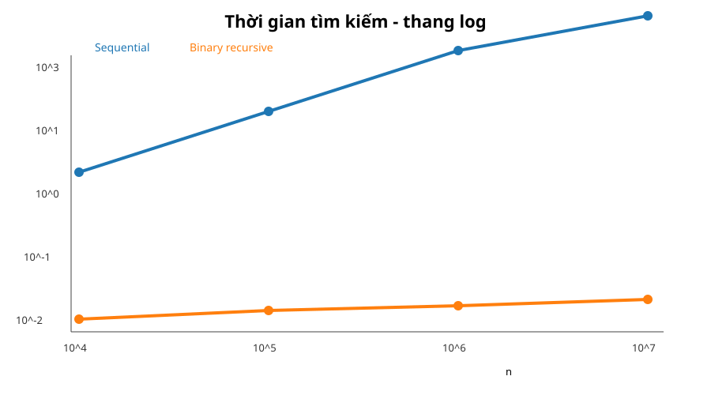
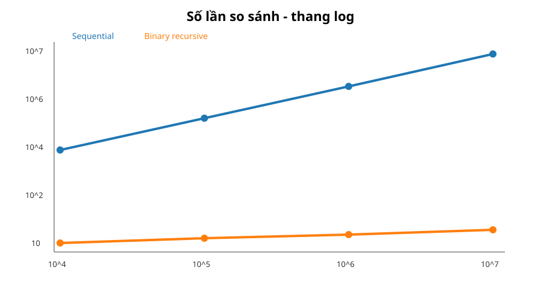

# Bài tập Buổi 5 - Tìm kiếm nhanh trong dữ liệu lớn

**Sinh viên:** Nguyễn Phương Anh Tú  
**MSSV:** 2611328

## Yêu cầu

So sánh 2 phương pháp trên mảng số nguyên đã sắp xếp:

- Sequential Search.
- Binary Search đệ quy theo Divide & Conquer.

Chạy với `n = 10,000; 100,000; 1,000,000; 10,000,000`, đo thời gian và số lần so sánh.

## Cách tạo dữ liệu

```text
data[i] = 2*i
target = data[n-1]
```

Target được chọn là phần tử cuối mảng để Sequential Search rơi vào worst-case và sự khác biệt với Binary Search thể hiện rõ.

## Kết quả thực nghiệm

Build: `g++ -std=c++17 -O2 -Wall -Wextra`.

| n | Sequential (µs/search) | Binary (µs/search) | Sequential comparisons | Binary comparisons |
|---:|---:|---:|---:|---:|
| 10,000 | 3.170 | 0.012 | 10,000 | 14 |
| 100,000 | 29.971 | 0.017 | 100,000 | 17 |
| 1,000,000 | 302.177 | 0.020 | 1,000,000 | 20 |
| 10,000,000 | 3,052.798 | 0.025 | 10,000,000 | 24 |





## Phân tích

### Sequential Search

```text
T(n) = O(n)
```

Trong worst-case, target ở cuối mảng nên phải kiểm tra đủ `n` phần tử.

### Binary Search đệ quy

```text
T(n) = T(n/2) + O(1)
```

Sau `k` lần chia:

```text
n / 2^k = 1
=> k = log2(n)
=> T(n) = O(log n)
```

## Câu hỏi cuối bài

**Khi dữ liệu tăng từ 10^4 lên 10^7, tại sao thời gian của hai phương pháp thay đổi khác nhau?**

Sequential Search là `O(n)`, nên trong worst-case số phép so sánh tăng gần tỷ lệ thuận với kích thước dữ liệu. Dữ liệu tăng 1000 lần thì lượng công việc cũng tăng xấp xỉ 1000 lần.

Binary Search là `O(log n)`. Mỗi lần so sánh loại bỏ khoảng một nửa vùng tìm kiếm. Vì vậy dù dữ liệu tăng từ `10^4` lên `10^7`, số lần so sánh trong bài chỉ tăng từ **14 lên 24**.

**Kết luận:** với mảng đã sắp xếp và dữ liệu lớn, Binary Search mở rộng tốt hơn rất nhiều.

## File

- `src/sequential_search.cpp`
- `src/binary_search_recursive.cpp`
- `src/search_benchmark.cpp`
- `results/results.csv`
- `results/console_output.txt`
- `results/time_comparison.svg`
- `results/comparisons.svg`
- `run.sh`

Bản ZIP nộp bài đi kèm còn có DOCX, PDF, PNG biểu đồ và ảnh đề bài.
