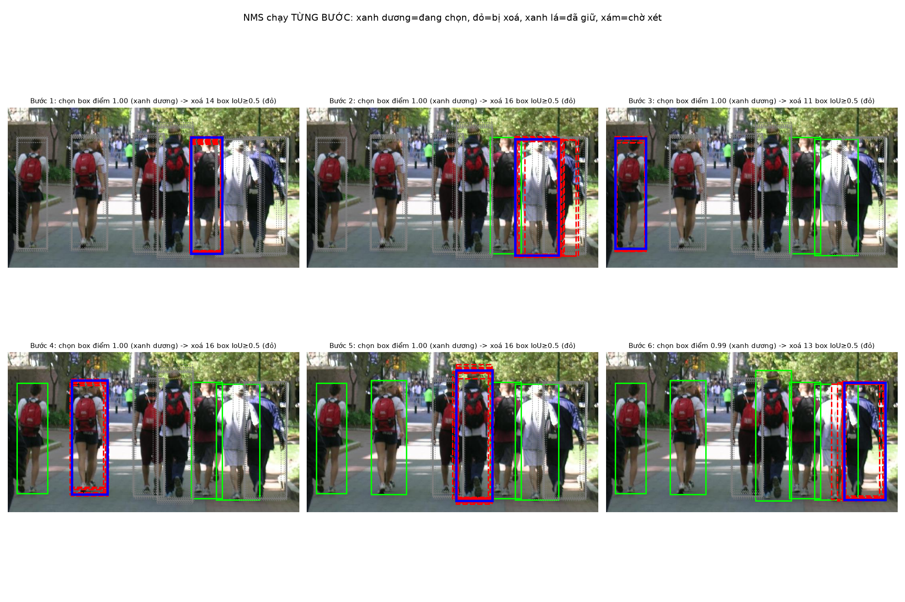
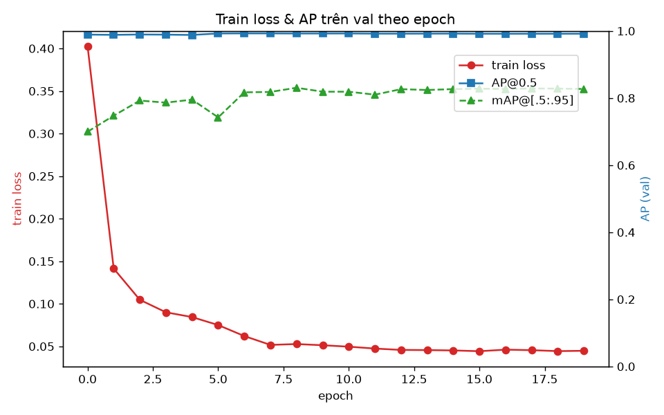
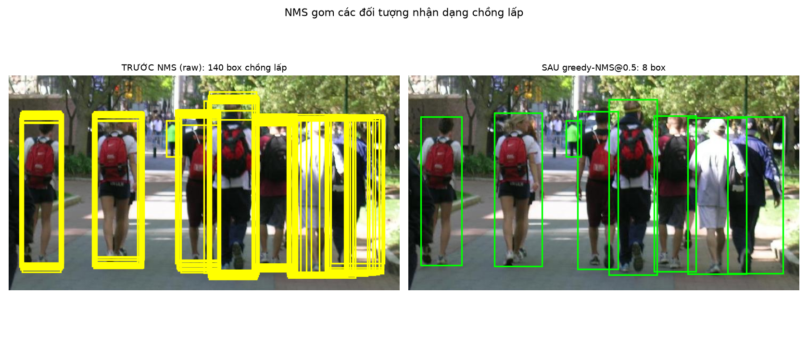
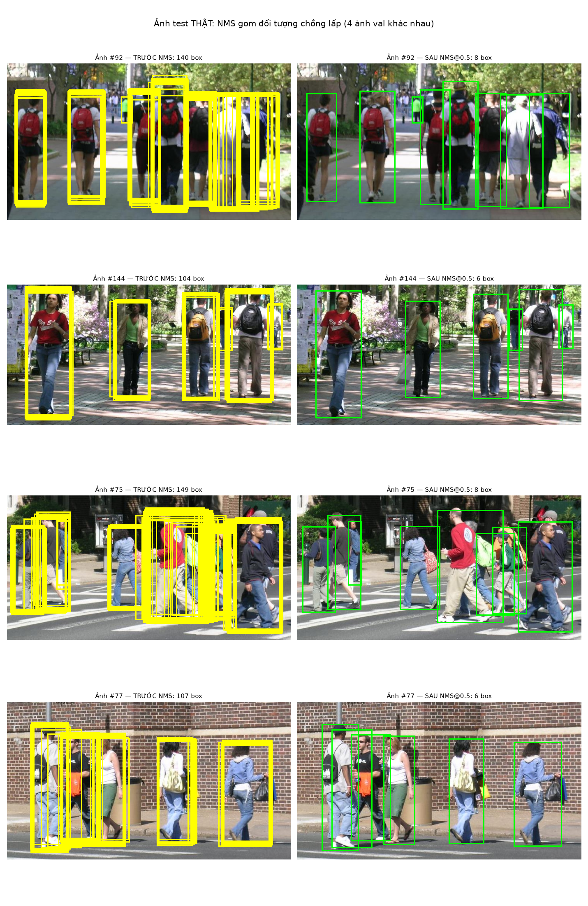
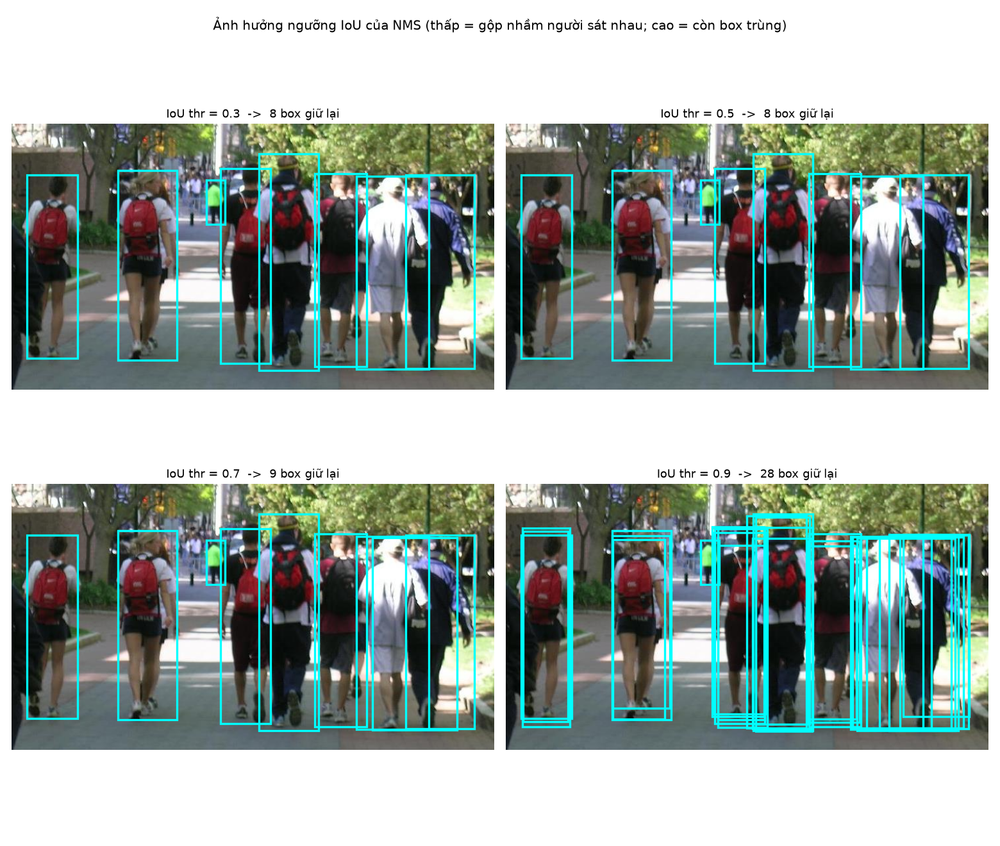
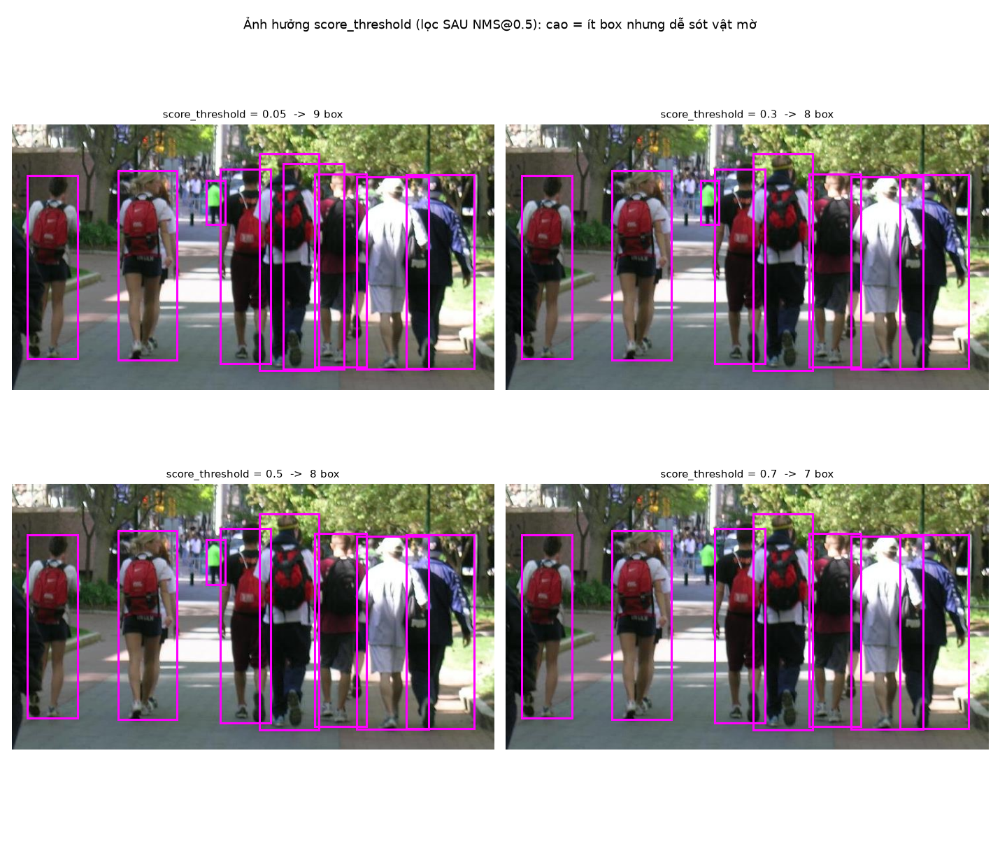
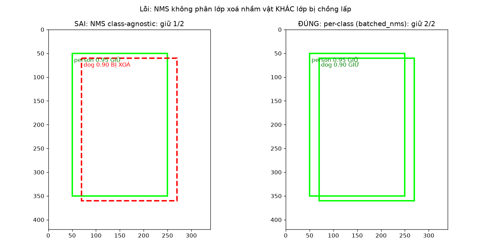
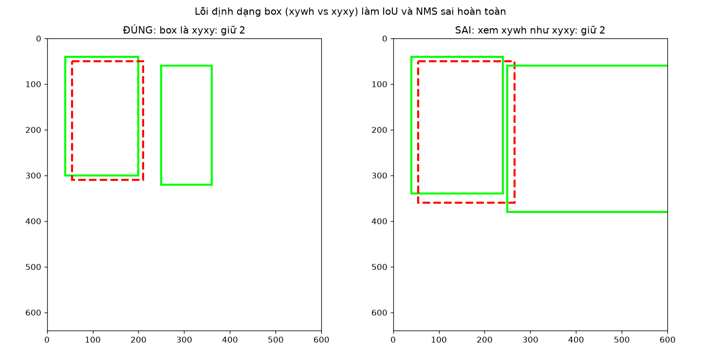

# Báo cáo thực hành: Non-Maximum Suppression (NMS) — lọc các phát hiện chồng lấp trong bài toán phát hiện đối tượng

**Môn học:** Computer Vision · **Học viên:** Nguyễn Phương Anh Tú · **MSHV:** 2611328
**Hình thức:** thực nghiệm có huấn luyện mô hình thực (Faster R-CNN) trên GPU RTX 5080.

> **Về tính trung thực của số liệu.** Mọi con số và hình ảnh trong báo cáo đều được sinh ra từ một lần chạy thực, trích trực tiếp từ `outputs/logs/` và `outputs/figures/`; không có giá trị giả định hay số liệu dựng sẵn. Quy trình tái lập được trình bày ở Mục 8.

---

## Nguồn tham khảo và trích dẫn

**Mô hình và các thành phần kiến trúc**
- Faster R-CNN — Ren, He, Girshick, Sun (2015): https://arxiv.org/abs/1506.01497
- Feature Pyramid Network (FPN) — Lin và cộng sự (2016): https://arxiv.org/abs/1612.03144
- ResNet (backbone ResNet-50) — He và cộng sự (2015): https://arxiv.org/abs/1512.03385
- R-CNN (NMS là thành phần chuẩn của detector) — Girshick và cộng sự (2014): https://arxiv.org/abs/1311.2524

**Dữ liệu**
- Penn-Fudan Pedestrian Database — trang chủ và tệp dữ liệu: https://www.cis.upenn.edu/~jshi/ped_html/
- MS COCO (tập pretrain của trọng số khởi đầu) — Lin và cộng sự (2014): https://arxiv.org/abs/1405.0312

**NMS và các biến thể được đề cập trong báo cáo**
- NMS hiệu quả (kinh điển) — Neubeck & Van Gool, ICPR 2006: https://ieeexplore.ieee.org/document/1699659
- Soft-NMS — Bodla và cộng sự (2017): https://arxiv.org/abs/1704.04503
- Learning NMS / GossipNet — Hosang và cộng sự (2017): https://arxiv.org/abs/1705.02950
- Adaptive-NMS (cảnh đông) — Liu và cộng sự (2019): https://arxiv.org/abs/1904.03629
- IoU-Net (xếp hạng theo chất lượng định vị) — Jiang và cộng sự (2018): https://arxiv.org/abs/1807.11590
- DIoU/CIoU và DIoU-NMS — Zheng và cộng sự (2020): https://arxiv.org/abs/1911.08287
- Cluster-NMS (kết hợp CIoU) — Zheng và cộng sự (2021): https://arxiv.org/abs/2005.03572
- Matrix-NMS (SOLOv2) — Wang và cộng sự (2020): https://arxiv.org/abs/2003.10152
- Fast-NMS (YOLACT) — Bolya và cộng sự (2019): https://arxiv.org/abs/1904.02689
- GIoU — Rezatofighi và cộng sự (2019): https://arxiv.org/abs/1902.09630
- DETR (hướng tiếp cận không cần NMS) — Carion và cộng sự (2020): https://arxiv.org/abs/2005.12872
- YOLOv10 (không cần NMS) — Wang và cộng sự (2024): https://arxiv.org/abs/2405.14458

**Công cụ và thư viện**
- torchvision — hướng dẫn finetune object detection: https://pytorch.org/tutorials/intermediate/torchvision_tutorial.html
- torchvision — trọng số Faster R-CNN (COCO_V1): https://pytorch.org/vision/stable/models/faster_rcnn.html
- torchvision.ops — `nms`, `batched_nms`, `box_iou`, `box_convert`: https://pytorch.org/vision/stable/ops.html
- uv (quản lý môi trường): https://docs.astral.sh/uv/
- PyTorch wheels CUDA 12.8 (cu128, cho GPU sm_120): https://download.pytorch.org/whl/cu128

> Danh mục arXiv đầy đủ kèm tên tác giả và hội nghị: [`../non_maximum_suppression/references.md`](../non_maximum_suppression/references.md).

---

## Mục lục
1. Giới thiệu và động lực
2. Cơ sở lý thuyết: IoU, thuật toán NMS và NMS chạy từng bước (kèm trace số học)
3. Phương pháp, thiết lập và ý nghĩa của từng tham số
4. Toàn bộ quá trình thực nghiệm
5. Kết quả và phân tích chuyên sâu
6. Các lỗi thường gặp và bài học rút ra
7. Kết luận
8. Phụ lục: tái lập và huấn luyện thêm (resume)

---

## 1. Giới thiệu và động lực

### 1.1. Bài toán
Phát hiện đối tượng (object detection) trả lời đồng thời hai câu hỏi *"trong ảnh có vật gì"* và *"vật đó nằm ở đâu"*, biểu diễn kết quả bằng hộp giới hạn (bounding box) kèm điểm tin cậy. Trong báo cáo này, đối tượng quan tâm là người đi bộ trong ảnh đường phố.

### 1.2. Vì sao xuất hiện các phát hiện chồng lấp?
Một detector hiện đại quét hàng nghìn khung neo (anchor) trên ảnh và được huấn luyện theo cơ chế gán nhãn một–nhiều, tức mỗi vật thật được khớp với nhiều dự đoán cùng lúc. Hệ quả tất yếu ở đầu ra là mỗi người thường bị bao quanh bởi cả một chùm hộp gần trùng nhau, thay vì một hộp duy nhất. Thực nghiệm của chúng tôi đo trực tiếp hiện tượng này: trên một ảnh có 7 người, mô hình sinh ra tới 140 hộp chồng lấp (chi tiết ở Mục 5.2). Vì vậy cần một bước hậu xử lý để gom mỗi chùm hộp về một đại diện duy nhất, và đó chính là vai trò của NMS.

Hiện tượng này không riêng của detector học sâu mà có gốc rễ từ chính cách phát hiện đối tượng cổ điển: cửa sổ trượt (sliding window) quét mọi vị trí và mọi tỉ lệ, nên các cửa sổ kề nhau cùng kích hoạt trên một vật. Cơ chế đó được trình bày và minh hoạ bằng một bộ phát hiện thật (HOG + SVM) trong notebook đi kèm [`Sliding_Window_to_NMS.ipynb`](Sliding_Window_to_NMS.ipynb), nên đọc trước báo cáo này.

### 1.3. Mục tiêu
Báo cáo hướng tới ba mục tiêu: (1) huấn luyện một detector trên dữ liệu thực; (2) tự cài đặt thuật toán greedy NMS từ đầu và kiểm chứng tính đúng đắn; (3) phân tích ý nghĩa của từng tham số cùng những lỗi thường gặp, nhằm hiểu cơ chế NMS một cách thấu đáo nhất.

---

## 2. Cơ sở lý thuyết

### 2.1. IoU — thước đo độ chồng lấp
$$\text{IoU}(A,B)=\frac{\text{diện tích}(A\cap B)}{\text{diện tích}(A\cup B)}\in[0,1].$$
Giá trị IoU bằng 0 khi hai hộp rời nhau hoàn toàn và bằng 1 khi chúng trùng khít. NMS sử dụng một ngưỡng $N_t$ làm tiêu chí gộp: hai hộp có $\text{IoU}\ge N_t$ được coi là cùng mô tả một vật.

### 2.2. Thuật toán Greedy NMS (xử lý riêng từng lớp)
1. Sắp xếp các hộp theo điểm tin cậy giảm dần.
2. Chọn hộp có điểm cao nhất $M$ và giữ lại.
3. Loại bỏ mọi hộp còn lại có $\text{IoU}(M,b)\ge N_t$.
4. Lặp lại với phần còn lại cho đến khi không còn hộp nào.

Phần cài đặt thực tế trong `nms.py` tuân thủ ba quy tắc cốt lõi: kiểm tra (`assert`) đúng định dạng `[N,4]` theo quy ước xyxy; xử lý an toàn trường hợp tensor rỗng; và luôn duyệt các hộp theo điểm tin cậy giảm dần.

### 2.3. Độ phức tạp và lý do thuật toán mang tính tuần tự
Trong trường hợp xấu nhất, greedy NMS có độ phức tạp $O(n^2)$. Quan trọng hơn, thuật toán mang bản chất tuần tự: mỗi vòng lặp phụ thuộc vào kết quả của vòng trước, nên rất khó song song hoá. Chính hạn chế này là động lực cho các biến thể như Cluster-NMS hay Matrix-NMS (xem phần tham khảo ở đầu báo cáo).

### 2.4. NMS chạy từng bước (kèm trace số học)
Phần này làm rõ cơ chế NMS một cách trực quan nhất. Chúng tôi lấy đầu ra thô của mô hình (lọc với điểm $\ge 0.6$, còn lại 107 hộp) trên ảnh val số 92 gồm 7 người, chạy greedy-NMS ở ngưỡng 0.5 và ghi lại giá trị IoU thực ở từng bước (`outputs/logs/nms_trace.txt`):

```
Bước 1: GIỮ box điểm=0.997
    - IoU với box (điểm=0.988) = 0.956  -> XOÁ
    - IoU với box (điểm=0.991) = 0.940  -> XOÁ
    - IoU với box (điểm=0.995) = 0.922  -> XOÁ
    ... => còn lại 92 box để xét tiếp
Bước 2: GIỮ box điểm=0.997
    - IoU với box (điểm=0.990) = 0.988  -> XOÁ
    - IoU với box (điểm=0.971) = 0.977  -> XOÁ
    ... => còn lại 75 box để xét tiếp
```

Cách đọc kết quả: ở mỗi bước, hộp có điểm cao nhất sẽ loại bỏ toàn bộ những hộp đè lên nó (có IoU $\ge 0.5$); mỗi hộp được giữ lại tương ứng với một người. Sau vài bước, 107 hộp ban đầu rút gọn về đúng số người thật trong ảnh. Quá trình này được minh hoạ ở hình dưới:



Quy ước màu sắc: màu xanh dương là hộp đang được chọn (điểm cao nhất trong số còn lại); màu đỏ nét đứt là các hộp bị loại ở bước hiện tại (do có IoU $\ge 0.5$ với hộp xanh dương); màu xanh lá là các hộp đã được giữ ở những bước trước; màu xám chấm là các hộp còn chờ xét. Có thể thấy các hộp trùng nhau có IoU lên tới 0.92–0.99 nên việc loại bỏ là hoàn toàn hợp lý.

---

## 3. Phương pháp, thiết lập và ý nghĩa của từng tham số

| Hạng mục | Lựa chọn | Lý do |
|---|---|---|
| Dữ liệu | Penn-Fudan (170 ảnh, một lớp `person`) | quy mô nhỏ, người trong ảnh thường chen và đè lên nhau nên rất lý tưởng để nghiên cứu NMS, đồng thời huấn luyện nhanh |
| Mô hình | `fasterrcnn_resnet50_fpn` (pretrain COCO) chuyển sang 2 lớp | finetune hội tụ nhanh và có sẵn NMS nội bộ, có thể tắt để phục vụ nghiên cứu |
| Chia dữ liệu | seed=1, chia thành 120 ảnh train / 50 ảnh val | cố định để bảo đảm tái lập |
| Phần cứng | RTX 5080 (sm_120), torch 2.11.0+cu128 | wheel CUDA 12.8 là bắt buộc với GPU kiến trúc Blackwell |

### 3.1. Trọng số khởi đầu của quá trình finetune
Mô hình không được huấn luyện từ đầu mà finetune từ trọng số đã có sẵn:
- **Kiến trúc:** Faster R-CNN với backbone ResNet-50 kết hợp FPN.
- **Trọng số khởi đầu:** `fasterrcnn_resnet50_fpn(weights="DEFAULT")`, tương ứng `FasterRCNN_ResNet50_FPN_Weights.DEFAULT` (COCO_V1), được pretrain trên COCO train2017 với 80 lớp. torchvision tự động tải tệp `fasterrcnn_resnet50_fpn_coco-258fb6c6.pth` từ download.pytorch.org/models, có thể thấy trong log của epoch 0.
- **Phần giữ lại và phần thay thế:** chúng tôi giữ nguyên backbone, FPN, RPN và RoI (toàn bộ trọng số COCO), chỉ thay đầu phân loại `roi_heads.box_predictor` bằng `FastRCNNPredictor(in_features, 2)` cho hai lớp (nền và `person`), khởi tạo ngẫu nhiên rồi huấn luyện tiếp. Chi tiết nằm trong `model.py`.
- **Lý do hiệu quả:** vì COCO vốn đã có lớp `person`, đặc trưng học được rất phù hợp với bài toán, nên AP@0.5 đạt khoảng 0.99 ngay từ epoch 0 và toàn bộ quá trình hội tụ chỉ trong khoảng 2 phút.

### 3.2. Ý nghĩa của từng tham số đã sử dụng

**A. Tham số huấn luyện (`train.py`)**

| Tham số | Giá trị | Ý nghĩa | Khi điều chỉnh |
|---|---|---|---|
| `epochs` | 20 | số lần quét toàn bộ tập train | quá ít sẽ học chưa tới (underfit), quá nhiều thì tốn thời gian và có nguy cơ overfit; ở đây mô hình hội tụ vào khoảng epoch 8 |
| `batch_size` | 2 | số ảnh trong mỗi bước cập nhật | batch lớn cho gradient mượt hơn nhưng tốn VRAM (ảnh detection rất lớn); giá trị 2 là mặc định trong tutorial |
| `lr` (learning rate) | 0.005 | độ lớn của mỗi bước cập nhật trọng số | quá cao khiến loss dao động hoặc phân kỳ, quá thấp thì học chậm |
| `momentum` | 0.9 | quán tính của SGD (ghi nhớ hướng cập nhật cũ) | giúp vượt qua các vùng phẳng và hội tụ mượt hơn; đặt quá cao dễ vượt qua điểm tối ưu (overshoot) |
| `weight_decay` | 5e-4 | hệ số phạt trọng số lớn (chính quy hoá L2) | hạn chế overfit; đặt quá lớn khiến mô hình kém linh hoạt và underfit |
| `StepLR(step=epochs//3, γ=0.1)` | step=6 | cứ sau 6 epoch lại nhân lr với 0.1 | giảm lr ở giai đoạn cuối để tinh chỉnh; nếu giảm quá sớm mô hình gần như ngừng học |
| warmup (epoch 0) | LinearLR 1e-3→1 | tăng dần lr ở giai đoạn đầu | tránh biến động gradient đột ngột khi trọng số đầu còn được khởi tạo ngẫu nhiên |
| AMP (`autocast` + `GradScaler`) | bật | tính toán ở nửa độ chính xác (fp16) | nhanh và tiết kiệm VRAM trên RTX 5080; `GradScaler` ngăn hiện tượng underflow gradient ở fp16 |
| `val_size` / `seed` | 50 / 1 | cố định tập val và cách chia dữ liệu | bảo đảm so sánh công bằng và tái lập được |

**B. Tham số của detector ở khâu hậu xử lý (`roi_heads`, dùng trong `study_nms.py`)**

| Tham số | Giá trị (khi khảo sát hộp thô) | Ý nghĩa | Tác động |
|---|---|---|---|
| `score_thresh` | 0.05 | ngưỡng điểm tối thiểu để giữ một detection | đặt cao thì ít hộp và sạch hơn, nhưng dễ bỏ sót vật mờ hoặc ở xa (xem Mục 5.5) |
| `nms_thresh` | đặt 1.0 (tắt) | ngưỡng IoU của NMS nội bộ trong mô hình | mặc định là 0.5; ở đây đặt 1.0 để lộ toàn bộ hộp thô phục vụ nghiên cứu |
| `detections_per_img` | 300 | số hộp tối đa giữ lại mỗi ảnh | mặc định là 100; tăng lên để quan sát rõ hiện tượng nhiều hộp chồng lấp |

**C. Tham số trung tâm của NMS (`nms.py`)**

| Tham số | Ý nghĩa | Phân tích |
|---|---|---|
| `iou_thr` ($N_t$) | hai hộp có IoU $\ge N_t$ được coi là cùng một vật, nên hộp điểm thấp hơn bị xoá | đặt quá thấp thì gom mạnh và có rủi ro gộp nhầm hai người sát nhau (làm rớt recall ở cảnh đông); đặt quá cao thì giữ lại nhiều hộp trùng (nhiễu). Kết quả quét tham số trình bày ở Mục 5.4 |

**D. Các độ đo**
IoU đo độ chồng lấp giữa hai hộp, nhận giá trị trong [0,1]. AP@0.5 là AP tại ngưỡng IoU dễ (0.5), trả lời câu hỏi mô hình có phát hiện đúng vật hay không. mAP@[.5:.95] là trung bình của AP qua các ngưỡng IoU từ 0.50 đến 0.95, đòi hỏi hộp phải khít với vật thật (đây là chỉ số chuẩn của COCO). Recall là tỉ lệ vật thật được mô hình tìm thấy.

---

## 4. Toàn bộ quá trình thực nghiệm

**Bước 1 — Kiểm tra GPU (bước xác nhận bắt buộc).** Chạy `uv run python check_env.py`:
```
torch 2.11.0+cu128 | torchvision 0.26.0+cu128
cuda available: True | device: NVIDIA GeForce RTX 5080 | cap: (12, 0)
cuda matmul OK: True
```
Bước này xác nhận wheel cu128 chạy được trên GPU Blackwell trước khi huấn luyện, tránh tình huống vô tình huấn luyện trên CPU.

**Bước 2 — Tải dữ liệu.** Chạy `uv run python download_data.py`, kết quả `images: 170 masks: 170` (tệp zip 53.7 MB). Hộp giới hạn được suy ra từ mask bằng `masks_to_boxes`, kèm bước loại bỏ các hộp suy biến.

**Bước 3 — Huấn luyện 20 epoch.** Chạy `uv run python train.py --epochs 20`, mất khoảng 2 phút với tốc độ chừng 5.5 giây mỗi epoch. Toàn bộ lịch sử huấn luyện thực tế:

| epoch | loss | AP@0.5 | mAP | | epoch | loss | AP@0.5 | mAP |
|---|---|---|---|---|---|---|---|---|
| 0 | 0.403 | 0.989 | 0.700 | | 10 | 0.050 | 0.993 | 0.819 |
| 1 | 0.141 | 0.989 | 0.748 | | 11 | 0.047 | 0.992 | 0.810 |
| 2 | 0.105 | 0.990 | 0.793 | | 12 | 0.046 | 0.992 | 0.827 |
| 3 | 0.090 | 0.989 | 0.786 | | 13 | 0.046 | 0.992 | 0.824 |
| 4 | 0.084 | 0.988 | 0.795 | | 14 | 0.045 | 0.992 | 0.827 |
| 5 | 0.075 | 0.993 | 0.743 | | 15 | 0.044 | 0.992 | 0.828 |
| 6 | 0.062 | 0.993 | 0.817 | | 16 | 0.046 | 0.992 | 0.827 |
| 7 | 0.052 | 0.993 | 0.818 | | 17 | 0.046 | 0.992 | 0.829 |
| **8** | 0.053 | 0.993 | **0.831** | | 18 | 0.044 | 0.992 | 0.828 |
| 9 | 0.051 | 0.993 | 0.819 | | 19 | 0.045 | 0.992 | 0.827 |



Trong quá trình huấn luyện, chúng tôi áp dụng hai điều chỉnh về phương pháp:
1. **Lịch giảm lr theo số epoch** (`step_size=epochs//3`): khi huấn luyện 20 epoch, lr giảm dần đều thay vì giảm quá sớm khiến mô hình gần như ngừng học.
2. **Chọn mô hình tốt nhất theo mAP@[.5:.95] thay vì AP@0.5:** do AP@0.5 đã bão hoà quanh 0.99 (gần như nằm ngang) nên không còn khả năng phân biệt giữa các epoch, trong khi mAP@[.5:.95] mới phản ánh được độ chính xác về định vị. Theo tiêu chí này, `best.pth` ứng với epoch 8 (mAP 0.831).

**Bước 4 — Sinh hình và bảng.** Chạy `uv run python study_nms.py` và `uv run python nms_deep_dive.py`. Cả hai đều in `NMS self-check OK`, đồng thời tạo ra 8 hình cùng các tệp `nms_sweep.csv` và `nms_trace.txt`.

---

## 5. Kết quả và phân tích chuyên sâu

### 5.1. Chất lượng của detector
AP@0.5 đạt khoảng 0.99 ngay từ epoch 0, cho thấy việc xác định vị trí của người gần như đúng hoàn toàn ở ngưỡng dễ. Trong khi đó, mAP@[.5:.95] tăng từ 0.70 lên 0.83 rồi bão hoà từ khoảng epoch 8, nghĩa là mô hình đã hội tụ và việc huấn luyện thêm không mang lại lợi ích đáng kể — đây là minh chứng cho thấy 20 epoch là đủ. Một hệ quả quan trọng về phương pháp: vì AP@0.5 đã bão hoà nên không thể dùng nó để so sánh mô hình trong bài này, mà phải dựa vào mAP@[.5:.95]. Đây cũng chính là lý do COCO chọn mAP@[.5:.95] làm chỉ số chính.

### 5.2. NMS gom các đối tượng chồng lấp — so sánh trước và sau


Trên ảnh val đông nhất (7 người), khi tắt NMS ở tầng cuối, mô hình cho ra 140 hộp chồng chất lên nhau (ảnh trái); sau khi áp greedy-NMS ở ngưỡng 0.5, kết quả chỉ còn 8 hộp sạch sẽ (ảnh phải). Để bảo đảm trung thực, cần lưu ý rằng NMS ở tầng RPN vẫn được bật; phạm vi nghiên cứu của chúng tôi là NMS ở đầu phát hiện cuối cùng.

### 5.3. Kết quả trên nhiều ảnh kiểm thử (không chọn lọc thiên vị)


NMS hoạt động nhất quán trên 4 ảnh val khác nhau: cột trái là chùm hộp thô, cột phải là kết quả đã được làm sạch sau NMS ở ngưỡng 0.5. Kết quả ổn định này cho thấy hiệu quả của NMS không phụ thuộc vào một ảnh đơn lẻ.

### 5.4. Ảnh hưởng của ngưỡng IoU — phân tích đánh đổi


Số hộp giữ lại trên ảnh đông tăng dần theo ngưỡng: 8 hộp ở 0.3, 10 hộp ở 0.5, 11 hộp ở 0.7 và 42 hộp ở 0.9. Bảng dưới đây tổng hợp kết quả trên toàn bộ tập val (`nms_sweep.csv`):

| Ngưỡng IoU | AP@0.5 | Recall | Số hộp TB/ảnh sau NMS |
|---|---|---|---|
| 0.3 | 0.9936 | 1.000 | 2.86 |
| 0.4 | 0.9929 | 1.000 | 2.92 |
| 0.5 | 0.9925 | 1.000 | 3.28 |
| 0.6 | 0.9916 | 1.000 | 3.92 |
| 0.7 | 0.9898 | 1.000 | 5.18 |
| 0.9 | 0.9469 | 1.000 | 21.68 |

Có thể thấy số hộp giữ lại tăng đơn điệu (từ 2.86 lên 21.68): ngưỡng càng cao thì tiêu chí gộp càng lỏng, khiến nhiều hộp trùng sống sót và trở thành dương tính giả, kéo theo AP@0.5 giảm dần (từ 0.9936 xuống 0.9469). Như vậy, vùng giá trị hợp lý nằm trong khoảng 0.3–0.5.

### 5.5. Ảnh hưởng của score_threshold


Khi lọc theo điểm tin cậy ở bước sau NMS@0.5, số hộp giữ lại là: 9 hộp ở ngưỡng 0.05, 8 hộp ở 0.3, 8 hộp ở 0.5 và 7 hộp ở 0.7. Ngưỡng càng cao càng loại được những hộp điểm thấp (thường là người mờ hoặc ở xa), nhờ đó giảm dương tính giả nhưng đồng thời dễ bỏ sót vật. Đây là tham số điều tiết cân bằng giữa precision và recall thứ hai, bên cạnh ngưỡng IoU.

### 5.6. Vì sao Recall luôn bằng 1.0 ở mọi ngưỡng?
Trên tập val Penn-Fudan, các nhân vật tách nhau khá rõ và detector lại đủ mạnh, nên ngay cả ở ngưỡng 0.3 thuật toán cũng không xoá nhầm người thật, dẫn tới recall bằng 1.0. Mặt trái của hiện tượng ngưỡng thấp làm rớt recall chỉ bộc lộ trên các dữ liệu cảnh đông gắt như CrowdHuman hay CityPersons, nơi hai người che khuất nhau khiến IoU giữa các hộp rất cao. Nói cách khác, kết luận về NMS phụ thuộc vào mức độ đông đúc của dữ liệu.

---

## 6. Các lỗi thường gặp và bài học rút ra

### 6.1. NMS không phân lớp (class-agnostic) xoá nhầm vật khác lớp


Khi hai hộp đè lên nhau nhưng thuộc hai lớp khác nhau (chẳng hạn person và dog), một NMS gộp chung mọi lớp sẽ xoá mất một hộp (chỉ giữ 1 trong 2). Cách làm đúng là chạy NMS riêng cho từng lớp, dùng `torchvision.ops.batched_nms` (giữ được cả 2).

### 6.2. Sai định dạng hộp (xywh và xyxy)


Nếu đưa hộp định dạng `xywh` vào một hàm mong đợi `xyxy`, hộp sẽ bị phình hoặc tràn ra ngoài khung và IoU trở nên vô nghĩa. Cách làm đúng là chuyển đổi bằng `box_convert` trước khi xử lý; hàm `greedy_nms` của chúng tôi cũng đã có `assert` để chặn lỗi này.

### 6.3. Ngưỡng IoU quá thấp ở cảnh đông làm mất vật thật
Khi hai người che khuất nhau, IoU giữa các hộp vốn đã cao; nếu đặt ngưỡng quá thấp, thuật toán sẽ gộp nhầm và làm giảm recall. Cách khắc phục là nâng ngưỡng ở những vùng đông, hoặc dùng các biến thể như Soft-NMS, Adaptive-NMS, DIoU-NMS (xem phần tham khảo đầu báo cáo).

### 6.4. Quên lọc theo điểm hoặc quên sắp xếp theo điểm
Chạy NMS trực tiếp trên hàng nghìn hộp điểm thấp vừa chậm vừa giữ lại nhiều hộp thừa; còn nếu không sắp xếp theo điểm thì hộp đại diện được chọn sẽ sai. Cách làm đúng là lọc theo `score_threshold` trước, và luôn duyệt các hộp theo điểm giảm dần.

### 6.5. NMS trên tensor rỗng
Với ảnh không chứa vật nào, thuật toán dễ vỡ do lỗi shape hoặc argmax. Cách làm đúng là thêm bước guard cho trường hợp rỗng (đã được xử lý trong cài đặt).

### 6.6. Xếp hạng bằng điểm phân loại thay vì chất lượng định vị
Nếu chỉ dựa vào độ tự tin về lớp, thuật toán có thể giữ lại một hộp định vị lệch. Hướng khắc phục là dùng IoU-Net (xem phần tham khảo đầu báo cáo).

### 6.7. Chọn mô hình bằng chỉ số đã bão hoà (bài học từ chính dự án)
Việc chọn `best` theo AP@0.5 (vốn đã bão hoà quanh 0.99) dẫn tới chọn nhầm epoch. Cách làm đúng là chọn theo mAP@[.5:.95], và chúng tôi đã sửa lại điều này trong `train.py`.

### 6.8. Dùng API AMP đã lỗi thời
Các hàm `torch.cuda.amp.*` đã bị deprecated. Cách làm đúng là dùng `torch.amp.autocast('cuda')` cùng `torch.amp.GradScaler('cuda')` (đã áp dụng trong dự án).

---

## 7. Kết luận
- Chúng tôi đã huấn luyện mô hình Faster R-CNN (finetune từ trọng số COCO_V1) trên Penn-Fudan trong 20 epoch (khoảng 2 phút trên RTX 5080), đạt AP@0.5 khoảng 0.99 và mAP@[.5:.95] khoảng 0.83 (mô hình tốt nhất ở epoch 8); mô hình hội tụ rõ ràng nên 20 epoch là đủ.
- NMS gom hiệu quả các đối tượng chồng lấp, giảm từ 140 xuống còn 8 hộp; phần trace số học cho thấy các hộp trùng có IoU 0.92–0.99 nên việc xoá là chính xác.
- Về tham số then chốt: ngưỡng IoU chi phối số hộp giữ lại (từ 2.86 lên 21.68) và độ chính xác (AP@0.5 từ 0.9936 xuống 0.9469), còn score_threshold điều tiết cân bằng giữa precision và recall.
- Báo cáo cũng đúc kết 8 lỗi cần tránh, tất cả đều có minh chứng thực nghiệm.

## 8. Phụ lục — tái lập và huấn luyện thêm
```bash
cd computer_vision/nms_training
uv run python check_env.py
uv run python download_data.py
uv run python train.py --epochs 20
uv run python study_nms.py          # hình 01–05 + nms_sweep.csv
uv run python nms_deep_dive.py      # hình 06–08 + nms_trace.txt
# Huấn luyện thêm mà không làm lại từ đầu:
uv run python train.py --resume outputs/checkpoints/last.pth --epochs 24
```
Nhật ký đầy đủ kèm bảng từng epoch xem tại [`his.md`](his.md). Phần lý thuyết NMS đầy đủ xem tại [`../non_maximum_suppression/nghien_cuu_NMS.md`](../non_maximum_suppression/nghien_cuu_NMS.md).
