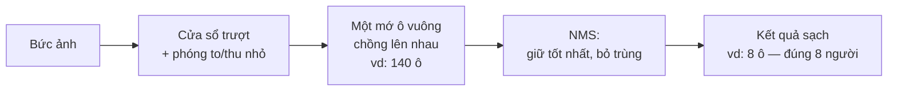

# Máy tính tìm người trong ảnh như thế nào? — Câu chuyện về Sliding Window và NMS

**Người trình bày:** Nguyễn Phương Anh Tú · Computer Vision (UTE)
**Đối tượng:** ai cũng nghe được — không cần biết lập trình hay toán.

> **Lời hứa với người nghe:** sau khoảng 5 phút, bạn sẽ hiểu được hai ý tưởng nằm sau cái ô vuông tự bám vào khuôn mặt khi bạn mở camera điện thoại: máy *quét* ảnh để tìm vật ra sao, và vì sao nó cần một bước *chọn lọc* tên là NMS. Mọi con số trong bài đều lấy từ thí nghiệm thật của dự án này.

---

## 1. Mở đầu: một việc tưởng dễ mà khó

Bạn nhìn vào một bức ảnh đường phố và lập tức biết "có hai người ở kia". Với bạn, việc này xảy ra trong tích tắc, không cần cố gắng.

Nhưng máy tính không "thấy" người — nó chỉ thấy một bảng số khổng lồ (mỗi điểm ảnh là vài con số màu). Nhiệm vụ của nó khó hơn ta tưởng: phải tự **khoanh một ô vuông quanh mỗi người** và nói "đây là người, tôi chắc chắn 90%".

> **Nói gọn:** việc bạn làm trong nháy mắt, máy phải làm bằng một quy trình. Bài nói này kể về quy trình đó.

---

## 2. Ý tưởng đầu tiên: "cửa sổ trượt" (Sliding Window)

Hãy tưởng tượng bạn cầm một **khung ảnh nhỏ bằng bìa cứng**, khoét một ô vuông ở giữa, rồi **rê khung đó đi khắp bức ảnh** — từ trái sang phải, trên xuống dưới. Mỗi lần dừng, bạn hỏi: *"Phần lọt trong ô này có phải người không?"*

Máy tính làm đúng như vậy. Người ta gọi cái khung là **cửa sổ (window)**, và việc rê khung đi khắp ảnh là **cửa sổ trượt (sliding window)**.

Nhưng có một rắc rối: người ở gần thì **to**, người ở xa thì **nhỏ**. Một cái khung cố định không thể vừa cả hai. Giải pháp rất đời thường: **phóng to / thu nhỏ cả bức ảnh** rồi rê khung lại từ đầu. Cứ thu nhỏ ảnh dần dần, ta được một chồng ảnh từ to đến nhỏ — gọi là **kim tự tháp ảnh (image pyramid)**. Người to ở ảnh gốc sẽ "vừa khít" cái khung khi ảnh đã được thu nhỏ.

> **Nói gọn:** rê một cái khung nhỏ khắp ảnh để dò vật, và làm lại ở nhiều mức phóng to/thu nhỏ để bắt được vật mọi kích cỡ.

**Cái giá phải trả:** vì rê khung qua *mọi* vị trí và *mọi* mức zoom, số lần phải kiểm tra là rất lớn. Trong thí nghiệm của dự án, chỉ một bức ảnh đã phải xét tới **gần 7.000 cửa sổ** (khi rê khung sát nhau). Đây là điểm yếu về tốc độ của cách làm cổ điển — và là lý do các hệ thống hiện đại tìm cách thông minh hơn.

---

## 3. Hệ quả bất ngờ: một "mớ" ô vuông chồng lên nhau

Đây là điểm mấu chốt của cả bài.

Khi rê khung sát nhau, **rất nhiều ô vuông cạnh nhau cùng trúng một người**. Thêm vào đó, nhiều mức zoom cũng cùng phát hiện ra người đó. Kết quả: quanh **một** người có thể có **hàng chục ô vuông gần như chồng khít** lên nhau.

Con số thật từ thí nghiệm:
- Một ảnh hai người đi bộ → máy phun ra **118 ô vuông** chồng chất.
- Một ảnh đông hơn (bảy người) với mô hình mạnh hơn → tới **140 ô vuông**.

Hãy hình dung bạn nhờ 40 người bạn cùng chỉ tay vào một người đi đường; tất cả đều chỉ đúng, nhưng bạn nhận về 40 cái chỉ tay cho **một** người. Quá thừa. Ta cần một cách để rút 40 cái đó về **một** cái đại diện tốt nhất.

> **Nói gọn:** cách dò bằng cửa sổ trượt khiến mỗi vật bị bao bởi cả một chùm ô vuông trùng nhau. Bước tiếp theo sinh ra chính là để dọn chùm đó.

---

## 4. Ý tưởng thứ hai: NMS — "giữ cái tốt nhất, bỏ cái trùng"

**NMS** (Non-Maximum Suppression — tạm dịch: *loại bỏ những cái không phải tốt nhất*) là một quy tắc đơn giản đến bất ngờ. Cách dễ hình dung nhất là việc bạn **dọn ảnh trùng trong điện thoại**:

Bạn chụp liên tiếp 30 tấm cùng một khoảnh khắc. Khi dọn, bạn làm thế này:
1. Chọn **tấm đẹp nhất** (rõ nhất, ưng ý nhất) — giữ lại.
2. Những tấm **gần giống hệt** nó — xoá đi.
3. Quay lại bước 1 với những tấm còn lại (thuộc khoảnh khắc khác).

NMS làm y hệt với các ô vuông:
1. Chọn ô máy **tự tin nhất** — giữ lại; đó là một người.
2. Mọi ô **chồng lên nó nhiều** (rõ ràng cùng một người) — bỏ.
3. Lặp lại cho người tiếp theo, đến khi hết.

Kết quả thật, đo trực tiếp:
- **118 ô → còn 6 ô** (ảnh hai người, cách dò cổ điển).
- **140 ô → còn 8 ô** (ảnh bảy người, mô hình học sâu).

Trong thí nghiệm, những ô bị xoá chồng lên ô được giữ tới **92–99%** — tức gần như trùng khít, nên việc xoá là hoàn toàn hợp lý.

> **Nói gọn:** NMS = "với mỗi vật, giữ ô tốt nhất, xoá các ô trùng với nó". Đơn giản vậy thôi, nhưng thiếu nó thì kết quả nhìn như một mớ bòng bong.

---

## 5. Hai "nút điều chỉnh" — và vì sao chúng quan trọng

Hệ thống có hai cái nút vặn, giống như nút âm lượng, quyết định kết quả cuối:

**Nút 1 — Độ tự tin tối thiểu.** Máy chỉ báo khi đủ chắc chắn. Vặn cao thì kết quả sạch nhưng **dễ bỏ sót** người mờ, người ở xa. Vặn thấp thì bắt được nhiều hơn nhưng **lẫn báo nhầm**. Giống độ nhạy của bộ lọc thư rác: quá gắt thì lọt thư thật, quá lỏng thì đầy thư rác.

**Nút 2 — Mức "coi là trùng".** Hai ô phải giống nhau tới đâu thì xem là cùng một người? Vặn để gộp mạnh thì gọn, nhưng nếu hai người **đứng sát che nhau**, máy có thể nhầm họ là một và **bỏ sót một người**. Đây chính là chỗ khó nhất của NMS ở những cảnh thật đông đúc.

> **Nói gọn:** không có con số "đúng tuyệt đối"; chỉnh hai nút này là cân bằng giữa "bỏ sót" và "báo nhầm", tuỳ bài toán.

---

## 6. Vì sao bạn nên quan tâm? (phần thuyết phục)

Hai ý tưởng nghe có vẻ học thuật này đang chạy lặng lẽ trong những thứ bạn dùng hằng ngày:

- **Xe tự lái** khoanh người đi bộ, xe khác, biển báo — rồi NMS lọc để không "thấy" một người thành ba.
- **Camera an ninh / đếm người** trong cửa hàng, sân vận động.
- **Điện thoại** lấy nét vào khuôn mặt; ứng dụng làm đẹp, chấm công bằng khuôn mặt.
- **Y tế:** đếm tế bào, khoanh khối u trên ảnh chụp.
- **Nông nghiệp, bán lẻ, thể thao:** đếm trái cây, nhận hàng trên kệ, bám theo cầu thủ.

Điểm chốt: **gần như mọi hệ thống "nhìn và nhận diện" đều đi qua đúng hai bước này** — dò ra nhiều ô, rồi lọc lại bằng NMS. Hiểu hai bước này là hiểu bộ khung chung của cả lĩnh vực, dù sau này công nghệ lõi có đổi.

---

## 7. Bằng chứng từ dự án (số thật, không tô vẽ)

Toàn bộ con số dưới đây sinh ra từ chạy thật, không phải ví dụ bịa:

| Hạng mục | Kết quả thật |
|---|---|
| Cách dò cổ điển (HOG) trên 1 ảnh | 118 ô chồng lấp → **còn 6** sau NMS |
| Mô hình học sâu trên ảnh 7 người | 140 ô chồng lấp → **còn 8** sau NMS |
| Độ chồng của các ô bị xoá | 92–99% (gần như trùng khít) |
| Độ chính xác mô hình đã huấn luyện | nhận đúng "có người ở đâu" ~**99%** |
| Số cửa sổ phải xét trên 1 ảnh | tới **~7.000** (cho thấy cái giá của cách cổ điển) |

Muốn xem tận mắt từng bước (có hình minh hoạ chạy sẵn): mở notebook [`nms_training/Sliding_Window_to_NMS.ipynb`](nms_training/Sliding_Window_to_NMS.ipynb).

---

## 8. Chốt lại trong ba câu

1. Máy tìm vật bằng cách **rê một cái khung khắp ảnh ở nhiều mức zoom** — đó là *sliding window*.
2. Cách đó khiến mỗi vật bị bao bởi **một chùm ô trùng nhau**, nên cần **NMS** để giữ ô tốt nhất và bỏ phần trùng.
3. Hai bước này là **bộ xương sống** của hầu hết hệ thống nhận diện ảnh — từ xe tự lái tới camera điện thoại.

> Một câu để nhớ: *"Dò ra thật nhiều, rồi giữ lại cái tốt nhất."*

---

## Phụ lục A — Thuật ngữ dịch ra tiếng người

| Thuật ngữ | Nói cho dễ hiểu |
|---|---|
| Bounding box (hộp giới hạn) | cái ô vuông khoanh quanh vật |
| Sliding window (cửa sổ trượt) | rê một cái khung nhỏ khắp ảnh để dò |
| Image pyramid (kim tự tháp ảnh) | làm lại việc dò ở nhiều mức phóng to/thu nhỏ |
| Confidence / score (độ tin cậy) | máy chắc chắn bao nhiêu phần trăm |
| IoU (độ chồng lấp) | hai ô vuông trùng nhau bao nhiêu |
| NMS | quy tắc "giữ ô tốt nhất, bỏ các ô trùng" |

## Phụ lục B — Câu hỏi hay gặp (bỏ túi khi thuyết trình)

- **"Sao không để máy báo thẳng một ô cho mỗi người?"** Vì cách dò sinh ra nhiều ô là điều khó tránh; lọc lại bằng NMS đơn giản và đáng tin hơn là ép máy "chỉ báo một lần".
- **"Hai người đứng sát nhau thì sao?"** Đó đúng là điểm yếu: nếu chỉnh gộp quá tay, máy có thể nhầm hai người thành một. Các phiên bản NMS nâng cao sinh ra để xử lý cảnh đông.
- **"Công nghệ mới có còn cần NMS không?"** Phần lớn vẫn cần. Một số kiến trúc mới nhất cố bỏ bước này, nhưng ý tưởng "tránh báo trùng" thì luôn còn đó.

## Phụ lục C — Tìm hiểu sâu hơn

- Minh hoạ chạy sẵn (có hình): [`nms_training/Sliding_Window_to_NMS.ipynb`](nms_training/Sliding_Window_to_NMS.ipynb)
- Báo cáo thực nghiệm đầy đủ: [`nms_training/report_NMS_thuc_hanh.md`](nms_training/report_NMS_thuc_hanh.md)
- Lý thuyết NMS chuyên sâu: [`non_maximum_suppression/nghien_cuu_NMS.md`](non_maximum_suppression/nghien_cuu_NMS.md)
